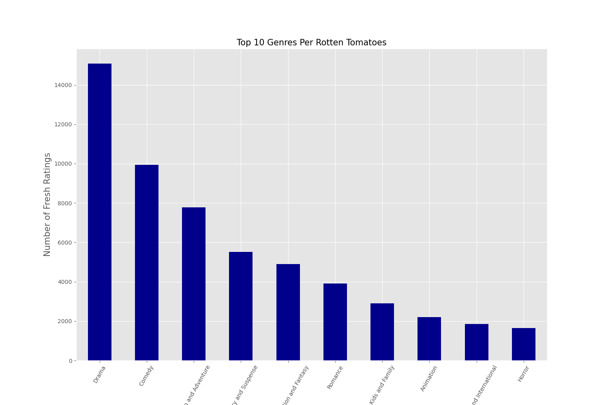
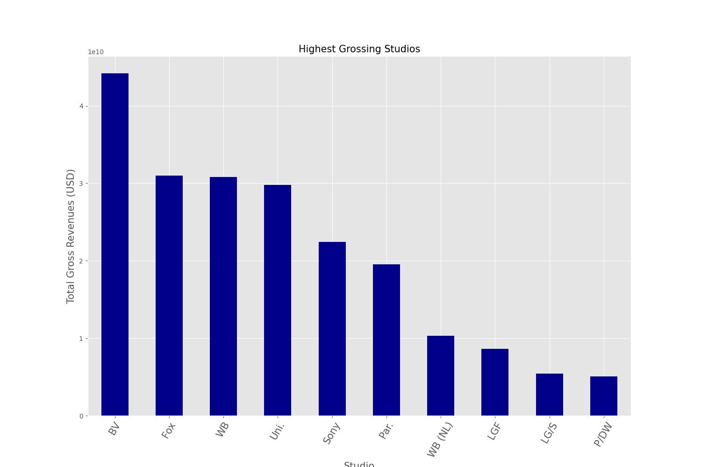

# Project Description
## Problem Statement
Microsoft has seen a business opportunity in the film industry, and has created the Microsoft Movie Studio. The company is looking for data centric insights from the film industry to aid in decision making on which films to focus on to ensure business success. Microsoft has charged us to carry out the analysis and come up with key recommendations.
## Business Understanding
The movie industry is global and encompasses the creation, production, distribution, and exhibition of movies. In 2019 the global box office generated $42.5B. Revenues in this industry can vary significantly depending on factors such as box office performance, home video sales, streaming rights, merchandising and licensing deals.

The success of a movie depends on many factors, key of which include:

* Story and content 
* Cast and crew 
* Marketing and distribution 
* Critical reception
* Genre and audience appeal 

## Project Objectives
1. Analyze film industry data and generate insights on best performing movies guided the five key movie success factors 
2. Provide top recommendations on films that Microsoft can focus on

## Data Understanding
The data was obtained from various movie websites and the IMDB database. These sources track movie attributes to various degrees e.g., titles, revenues, studios, years of release, movie ratings and other similar information.

1. [Box Office Mojo](https://www.boxofficemojo.com/)
2. [IMDB](https://www.imdb.com/)
3. [Rotten Tomatoes](https://www.rottentomatoes.com/)
4. [TheMovieDB](https://www.themoviedb.org/)
5. [The Numbers](https://www.the-numbers.com/)

Data 1,2,3 were used. Data 4 & 5 was excluded due to limited data fields.

## Observations and Conclusions
### 1.0 Most popular genres
We analyzed top critic review ratings by genre to establish the top rated genres.

### 2.0 Top grossing movie studios
This was established by grouping the data by studio and agregating the domestic & foreign gross.

### 3.0 Domestic versus foreign movie performance
This was established by grouping the foreign & domestic gross revenues by year

## Conclusion
Through the analysis we've established that the top rated genres include Drama, Comedy and Action. We've established the highest grossing studios. We've also seen that the the foreign market has much higher revenues with marked growth over the years while domestic revenues are lower and steady.

## Recommendations
From the analysis, we recommend the below:

* The top rated hence most popular genres are Drama, Comedy and Action. Investing in these genres is likely to give the highest returns.
* The highest grossing movie studios are Buena Vista (BV), Fox and Warner Bros.It will be important to connect/create partnerships with these studios as a means of boosting revenues or benchmarking their expertise in this field.
* Both domestic and foreign markets are key market segments to focus on right away; with the foreign market having almost double the domestic market revenues.

​
